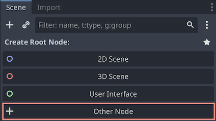
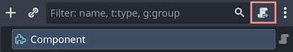
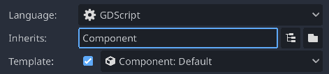

# Composition

A component-based architecture for Godot. Allows to extend the functionality of a node.

## Features

- Create components that extend the functionality of a node.
- Easy creation and management of components from the editor.
- Work with components as with regular nodes.
- Components can be created as scenes or scripts.
- Nested components and inheritance are supported.
- Fully documented.


## Installation

1. Download the latest release from the [releases page](https://github.com/Nordsoft91/composition/releases).
2. Extract the archive into your project's `addons` folder.
3. Enable the plugin in your project settings. To do this, open the project settings, go to the `Plugins` tab, and click the `On` button next to the `Composition` plugin.


## Composition vs inheritance

Composition is a different approach to inheritance. It allows to extend the functionality of a node without modifying the node's code.

Inheritance is a way to extend the functionality of a node by modifying the node's code. It is useful when you want to add new functionality to an existing node.

Composition is a way to extend the functionality of a node by adding new nodes as children of the node. It is useful when you want to add new functionality to an existing node without modifying the node's code.

## Usage

### Creating a component

#### Component scene

You can create component scene by inheriting `Component` node.




Select component node and press extend the script with your custom component script.



#### Component script

To define component, script must extends `Component`. The component will be automatically registered with the composition system.

Plugin automatically installs and selects component script template.



Components can be both unnamed or have specific `class_name` as any other object.

```gdscript
extends Component

@export var my_property: int = 0

# This method guarantees that all components are initialized.
func _node_ready() -> void:
	var node: Node = get_object() # Returns node that owns this component.
	var other_component: Component = other("MyComponent") # Returns sibling component with the given name.
```

> [!NOTE]
> It's sufficient to have script to define new component. You may not have new scene for each component.

### Work with components from the editor

Components belong to a node. Any node can be extended with components.

There is `Components` button in the node's inspector to see all components that belong to the node.


Once clicking it, you will see `ComponentOwner` node appeared in the node's hierarchy. This node will be parent of the components.


To create a new component press the `Create component` button in the node's inspector.

> [!NOTE]
> This button is available only in Godot 4.4 or higher. If you work with older versions, you can create component by adding new node as a child of the ComponenyOwner node and extending the script with your custom component script.


In pop-up dialog select a script or a scene to add a component.


You will be able to see and edit all the components that belong to the node from the inspector.


To return to the node's inspector press the `Node Properties` button.


To remove a component, find it in scene tree and remove normally as any other node.

> [!TIP]
> It's advised to name component script and scenes with some prefix, for example `component_`.

#### Nested scenes

If you have a nested scene, you can also add new components to the node. In this case, original scene will not be modified.

The only difference with nested scene is that components belong directly to the node instead of `ComponentOwner` in the editor.


#### Override properties

You can override properties of the component script in the node's inspector even for inherited scenes.


Once property is modified, new component object will be automatically created. This is normally for inherited scenes as this component copy will store modified value.


### Work with components from code

To get a component use `Component.find` method.

```gdscript
var component = Component.find(node, "MyComponent")
```

To get all components use `Component.all` method.

```gdscript
var components = Component.all(node)
```

To find all components that are instances of a certain type, use `Component.query()`.

```gdscript
var status_effects : Array[Component] = Component.query(node, StatusEffectComponent)
```

To add a component to a node use `Component.add` method.

```gdscript
Component.add(node, component)
```

To remove a component use `queue_free`, `free` or `remove_child` methods.

To get a node that owns a component use `get_object` method.

```gdscript
var node = component.get_object()
```

You can also use `other` method to get a sibling component with the given name.

```gdscript
var component_a = Component.find(node, "MyComponentA")
var component_b = component_a.other("MyComponentB")
```

> [!TIP]
> Documentation for all methods is located at addons/composition/component.gd

### Component owner

The component owner is a parent node for all components, owned by actual node you want to be extended with components.

You can find the component owner node in the node's hierarchy.

From code, you can get component owner node using `Component.component_owner` method.

```gdscript
# Returns component owner if it exists or null
var component_owner = Component.component_owner(node)
```

Or `Component.make_component_owner` method.

```gdscript
# Creates and returns component owner
# If it exists, equivalent to Component.component_owner(node)
var component_owner = Component.make_component_owner(node)
```

Component owner object has signals that are emitted when a component is added or removed.

```gdscript
func _ready():
	var component_owner = Component.component_owner(self)
	component_owner.connect("component_added", self, "_on_component_added")
	component_owner.connect("component_removed", self, "_on_component_removed")

func _on_component_added(component: Component) -> void:
	print("Component added: ", component)

func _on_component_removed(component: Component) -> void:
	print("Component removed: ", component)
```

## Contributing

Contributions are welcome! Please open an issue or submit a pull request.

If you want to support me you can https://buymeacoffee.com/nordsoft :blush:

## License

This project is licensed under the MIT License - see the [LICENSE](LICENSE) file for details.
