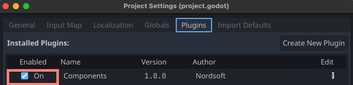
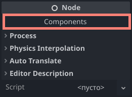
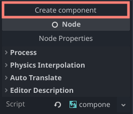
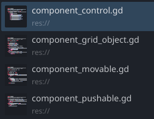
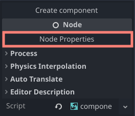
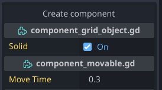

# Composition

A component-based architecture for Godot. Allows to extend the functionality of a node.

## Features

- Create components that extend the functionality of a node.
- Easy creation and management of components from the editor.
- Work with components as with regular nodes.
- Components can be created as scenes or scripts.
- Fully documented.


## Installation

1. Download the latest release from the [releases page](https://github.com/Nordsoft91/composition/releases).
2. Extract the archive into your project's `addons` folder.
3. Enable the plugin in your project settings. To do this, open the project settings, go to the `Plugins` tab, and click the `On` button next to the `Composition` plugin.




## Composition vs inheritance

Composition is a different approach to inheritance. It allows to extend the functionality of a node without modifying the node's code.

Inheritance is a way to extend the functionality of a node by modifying the node's code. It is useful when you want to add new functionality to an existing node.

Composition is a way to extend the functionality of a node by adding new nodes as children of the node. It is useful when you want to add new functionality to an existing node without modifying the node's code.

## Usage

### Creating a component

#### Component script

To create a component, create a new script that extends `Component`. The component will be automatically registered with the composition system.

```gdscript
extends Component

@export var my_property: int = 0

func _node_ready() -> void:
	var node: Node = get_object() # Returns node that owns this component.
	var other_component: Component = other("MyComponent") # Returns sibling component with the given name.
```

#### Component scene

To create a component, create a new scene that extends `Component`. The component will be automatically registered with the composition system.


Select component node and press eextend the script with your custom component script.

### Work with components from the editor

Components are owned by a node. Any node can be the owner of a component.
You can find `Components` button in the node's inspector to see the components that are owned by the node.



You can also find `ComponentOwner` node in the node's hierarchy. This node is the owner of the components.


To create a new component press the `Create component` button in the node's inspector.

*Note: This button is available only in Godot 4.4 or higher.
In this case, you can create a component by adding a new node as a child of the node and extending the script with your custom component script.*



Then select a script or a component scene to create a new component.
If scripts are not visible, search for them in the search bar. It's advised to name component script and scenes with some prefix, e.g. `component_` or `composition_`.



You will be able to see and edit all the components that are owned by the node from the inspector.


To return to the node's inspector press the `Node Properties` button.



If you have a nested scene, you can add new components to the node by adding new nodes as children of the desired node. Select `Component` node type and extend the script with your custom component script.


To remove a component, select it from scene tree and press the `Remove` button.

#### Nested scenes

If you have a nested scene, you can also add new components to the node. In this case, original scene will not be modified.


#### Override properties

You can override properties of the component script in the node's inspector.
But if you simply modify value it will not be saved.



First, you need to add new component which contains the property you want to override.
In the example from the screenshot, we will add `component_movable` component.


After that, you can override the property in the node's inspector.


### Work with components from code

To get a component use `Component.find` method.

```gdscript
var component = Component.find(node, "MyComponent")
```

To get all components use `Component.all` method.

```gdscript
var components = Component.all(node)
```

To add a component to a node use `Component.add` method.

```gdscript
Component.add(node, component)
```

To remove a component use `queue_free`, `free` or `remove_child` methods.

To get a node that owns a component use `get_object` method.

```gdscript
var node = component.get_object()
```

You can also use `other` method to get a sibling component with the given name.

```gdscript
var component_a = Component.find(node, "MyComponentA")
var component_b = component_a.other("MyComponentB")
```

### Component owner

The component owner is a node that owns the components. The owner node can be any node that has a ComponentOwner node as a child.

You can find the component owner node in the node's hierarchy.
From code, you can get the component owner node using `Component.component_owner` method.

```gdscript
var component_owner = Component.component_owner(node)
```

This object has signals that are emitted when a component is added or removed.

```gdscript
func _ready():
	var component_owner = Component.component_owner(self)
	component_owner.connect("component_added", self, "_on_component_added")
	component_owner.connect("component_removed", self, "_on_component_removed")

func _on_component_added(component: Component) -> void:
	print("Component added: ", component)

func _on_component_removed(component: Component) -> void:
	print("Component removed: ", component)
```

## Contributing

Contributions are welcome! Please open an issue or submit a pull request.

## License

This project is licensed under the MIT License - see the [LICENSE](LICENSE) file for details.
